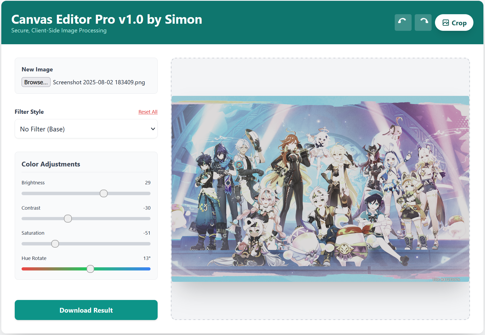

# 🖼️ Canvas Editor Pro (Client-Side Image Filter App)

This is a fast, secure, single-page web application built with **React** and the **HTML5 Canvas API**. It allows users to perform advanced color adjustments, apply filters, and crop/rotate images entirely in the browser, ensuring zero server-side data transfer and complete privacy.

**🌐 Live Demo:** **[View the Editor Here!](https://simonnchong.github.io/image_editor/)**
---

## 😘Example



## ✨ Key Features

| Feature | Description |
| :--- | :--- |
| **100% Client-Side** | All image processing (filters, adjustments, rotation) is performed using the browser's resources. **No server, no API keys, and total data privacy.** |
| **Interactive Crop Tool** | Click and drag directly on the image to define a custom cropping area, then apply to permanently resize the source image. |
| **Image Rotation** | Instant 90° clockwise and counter-clockwise rotation with clear visual icons. |
| **Real-Time Adjustments** | Fine-tune **Brightness**, **Contrast**, **Hue**, and **Saturation** using smooth sliders that apply changes immediately. |
| **Reset Function** | Instantly reverts all filters, adjustments, crops, and rotations to the original uploaded image state. |
| **Click-to-Zoom** | Click the final processed image to open a full-screen modal for detailed inspection before downloading. |

---

## 🎨 Available Filters & Adjustments

The editor combines hardware-accelerated **CSS filters** for color adjustments with custom **Convolution Kernels** for advanced pixel-level effects.

### Color and Tone Adjustments

| Adjustment | Range | Description |
| :--- | :--- | :--- |
| **Brightness** | -100 to 100 | Adjusts the overall lightness or darkness. |
| **Contrast** | -100 to 100 | Controls the separation between dark and light tones. |
| **Saturation** | -100 to 100 | Controls the intensity or purity of colors (vibrance). |
| **Hue Rotate** | -180° to 180° | Shifts all colors on the color wheel. |

### Preset Filter Styles

| Category | Filter Name | Effect |
| :--- | :--- | :--- |
| **Basic** | **Grayscale / Invert** | Classic black and white / Flips all colors (negative). |
| **Tonal** | **Sepia / Warm / Cool** | Applies a brown tint / Emphasizes warm tones / Emphasizes cool tones. |
| **Film** | **Vintage / Polaroid / Technicolor** | Cinematic looks using combined adjustments for specific aesthetics. |
| **Pixel** | **Pixelate** | Reduces image resolution dramatically for a chunky, retro effect. |
| **Convolution**| **Sharpen / Blur / Gaussian Blur** | Enhances edges or softens image details using kernel matrices. |
| **Geometry**| **Edge Detection / Emboss** | Detects and highlights hard lines / Gives a 3D stamped/relief appearance. |

---

## 🚀 Deployment and Setup

This project uses **Create React App** conventions and is deployed using a **GitHub Action** which handles the entire build process automatically.

### Prerequisites

To run this project locally or contribute, you need:

  * **Node.js (LTS)** and **npm** installed.
  * **Git** for version control.

### Local Setup and Running

1.  Clone the repository:
    ```bash
    git clone [https://github.com/simonnchong/image_editor.git](https://github.com/simonnchong/image_editor.git)
    cd image_editor
    ```
2.  Install dependencies:
    ```bash
    npm install
    ```
3.  Start the development server:
    ```bash
    npm start
    ```
    The application will open in your browser at `http://localhost:3000`.

### GitHub Pages Automated Deployment

Since you deployed by uploading raw source files, the GitHub Action is critical. It performs the necessary steps that `npm run build` would normally do on your machine:

1.  The configuration in **`.github/workflows/deploy.yml`** watches for new commits on the `main` branch.
2.  The GitHub Action runs, automatically executing the build and optimization steps.
3.  The final, optimized website files are pushed to the special **`gh-pages`** branch.
4.  GitHub Pages is configured to serve the site directly from the **`gh-pages`** branch.
